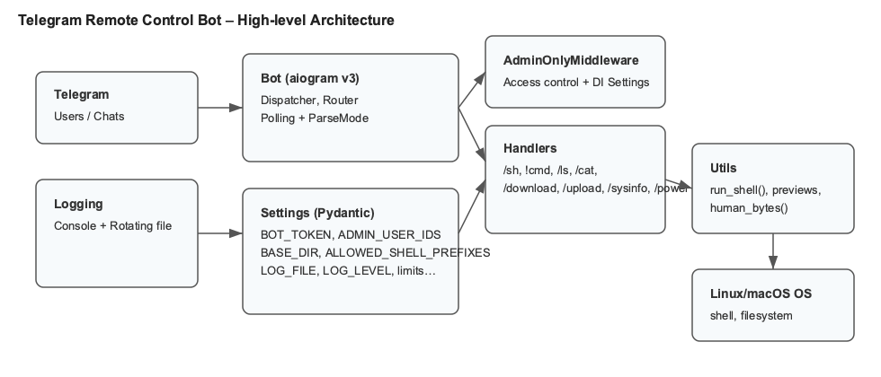
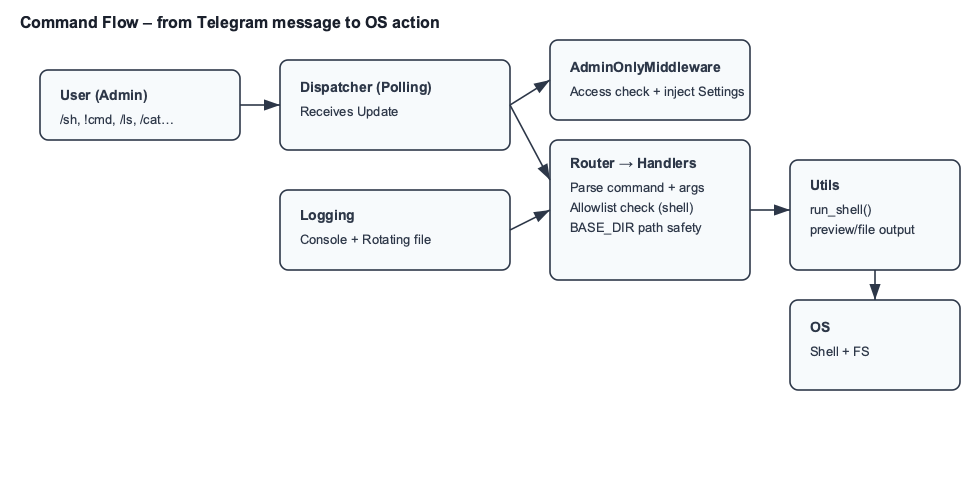
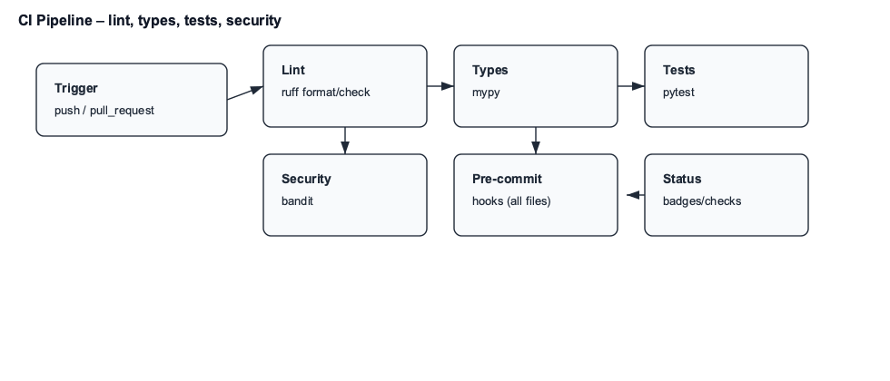

# Telegram Remote Control Bot (aiogram v3)

Admin-only Telegram bot to remotely manage a Linux machine using aiogram v3.

## Diagrams




> Note: If PNGs are missing or you edit the SVGs, generate PNGs with:
>
> ```bash
> python -m pip install -r requirements-dev.txt
> python scripts/make_pngs.py
> ```
>
> Source SVGs are in docs/images/ for high-DPI scaling.

Features
- Run shell commands: /sh <cmd> and quick !<cmd>
- List, view, upload, and download files under a configured BASE_DIR
- System info (/sysinfo)
- Optional power control (/power reboot|shutdown)
- Admin-only access via Telegram user IDs
- Optional rotating file logging (LOG_FILE)
- Optional per-command allowlist for shell commands

Security
- The bot is powerful. Restrict access with ADMIN_USER_IDS and a long BOT_TOKEN.
- File operations are confined to BASE_DIR.
- Power commands are disabled by default; enabling them requires sudo rules.
- You can lock /sh and !<cmd> to an allowlist of command names.

Quick start
1) Install dependencies (Python 3.10+ recommended):
```bash
python -m venv .venv
source .venv/bin/activate
pip install -r requirements.txt
```

2) Configure environment:
- Copy .env.example to .env and fill values.
- Set ADMIN_USER_IDS to your Telegram numeric ID(s).
- Optionally set LOG_FILE to enable rotating logs and ALLOWED_SHELL_PREFIXES to constrain shell.

3) Run the bot:
```bash
python main.py
```

Environment variables
- BOT_TOKEN: Telegram bot token from @BotFather
- ADMIN_USER_IDS: Comma-separated user IDs allowed to use the bot
- BASE_DIR: Root directory for file ops (default: current directory)
- ALLOW_POWER_CMDS: true/false to enable /power commands
- COMMAND_TIMEOUT_SEC: Timeout for shell commands (default: 20)
- MAX_TEXT_REPLY_CHARS: Max text length before sending as a file (default: 3500)
- MAX_UPLOAD_BYTES: Max file size for upload/download (default: ~45MB)
- LOG_FILE: Path to rotating log file (empty to disable file logging)
- LOG_LEVEL: DEBUG/INFO/WARNING/ERROR (default: INFO)
- LOG_MAX_BYTES, LOG_BACKUPS: Rotation size and backups (defaults: ~5MB, 5 backups)
- ALLOWED_SHELL_PREFIXES: Optional allowlist of command names (comma/semicolon-separated). If set, only these commands are allowed for /sh and !<cmd>.

Allowlist semantics
- Matching is by the first executable token after optional leading "sudo".
- Absolute paths are reduced to their basename (e.g., /bin/ls -> ls).
- Matching is case-insensitive and exact by command name (not prefix). For example, allowing "ls" does not allow "lsof".
- Examples:
  - ALLOWED_SHELL_PREFIXES="ls, echo, df, uname"
  - Allowed: "ls -la", "sudo /bin/ls -la", "ECHO hi"
  - Blocked: "lsof -i", "bash -c '...'" (unless you allow "bash")

Sudo example (optional)
To allow reboot/shutdown without password (adjust username and paths):
```bash
sudo visudo
# add line:
# youruser ALL=(ALL) NOPASSWD: /sbin/shutdown, /usr/sbin/reboot, /usr/sbin/poweroff, /usr/bin/reboot, /usr/bin/poweroff
```

## Testing
Prereqs:
```bash
pip install -r requirements.txt
pip install -r requirements-dev.txt
```

Run test suite:
```bash
pytest -q
```

Run a single test or pattern:
```bash
# single test function
pytest tests/test_utils.py::test_run_shell_echo -q
# by keyword
pytest -k run_shell -q
# verbose output
pytest -vv
```

Quality checks locally:
```bash
# format check + lint
ruff format --check .
ruff check .
# typing
mypy .
# security scan
bandit -c .bandit.yaml -r .
# unit tests
pytest -q
```

What tests cover:
- tests/test_config.py
  - _parse_admin_ids parsing and ignoring bad tokens
  - load_settings required vars, logging fields, allowlist normalization (Pydantic)
- tests/test_utils.py
  - run_shell happy path (echo) and timeout behavior
  - text_preview_or_file preview vs file and file contents
  - human_bytes formatting
- tests/test_handlers.py
  - _is_cmd_allowed exact-token matching (sudo/absolute/case-insensitive)
  - _resolve_under path resolution under BASE_DIR
  - _ensure_inside blocking path escapes

Test wiring notes:
- tests/conftest.py prepends the project root to sys.path so imports like `from bot...` work.
- Async tests use pytest-asyncio; no extra flags required.

CI status:
- GitHub Actions runs ruff format/lint, mypy, pytest, bandit, and pre-commit on push/PR (with pip caching) across Python 3.12/3.13.

## Docker
Prereqs: Docker and Docker Compose.

1) Prepare environment file:
```bash
cp .env.example .env
# edit .env and set at least:
# BOT_TOKEN=...
# ADMIN_USER_IDS=123456789
```

2) Run with Compose (recommended):
```bash
# build image and start in background
docker compose up -d --build
# view logs
docker compose logs -f
# stop
docker compose down
```
- A host ./data folder is mounted to /data inside the container.
- BASE_DIR=/data and LOG_FILE=/data/logs/bot.log are configured by compose.

3) Alternatively, run with docker run:
```bash
docker build -t tg-remote-bot .
docker run -d --name tg_remote_bot \
  --restart unless-stopped \
  --env-file .env \
  -e BASE_DIR=/data -e LOG_FILE=/data/logs/bot.log -e LOG_LEVEL=INFO \
  -v "$(pwd)/data:/data" \
  tg-remote-bot
```

Notes:
- The bot connects outbound to Telegram; no ports are exposed.
- Keep ALLOW_POWER_CMDS=false in Docker; container shutdown won’t reboot the host.

---

<p align="center">
   Made with ❤️ for the Ukrainian community<br>
   <strong>Слава Україні! 🇺🇦</strong>
</p>
