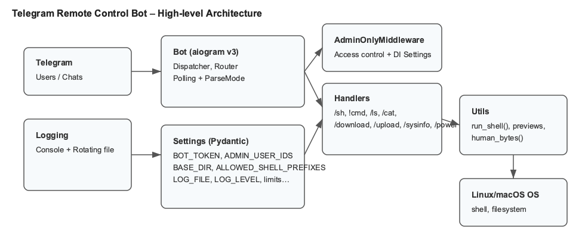

# Diagrams

Architecture



Command flow


CI pipeline


Note
- If PNGs are missing or you edit the SVGs, generate PNGs with:

```bash
python -m pip install -r requirements-dev.txt
python scripts/make_pngs.py
```

- Source SVGs are in docs/images/ for high-DPI scaling.
